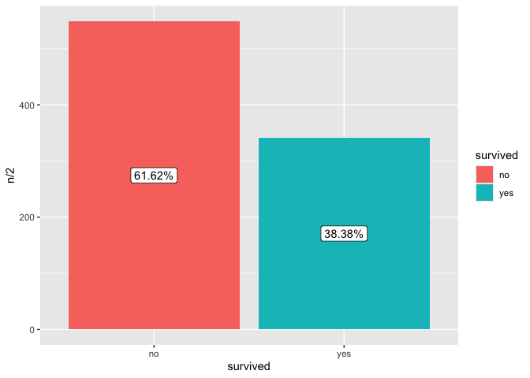

# Lab_5


``` r
knitr::opts_chunk$set(warning = FALSE, message = FALSE)
```

``` r
library(tidyverse)
library(knitr)

# Read in the data
titanic <- read_csv("https://raw.githubusercontent.com/nt246/NTRES-6100-data-science/master/datasets/Titanic.csv")
```

``` r
# look at the top 5 lines of the dataset
titanic |> 
  head(5) |>
  kable()
```

| PassengerId | Survived | Pclass | Name | Sex | Age | SibSp | Parch | Ticket | Fare | Cabin | Embarked |
|---:|---:|---:|:---|:---|---:|---:|---:|:---|---:|:---|:---|
| 1 | 0 | 3 | Braund, Mr. Owen Harris | male | 22 | 1 | 0 | A/5 21171 | 7.2500 | NA | S |
| 2 | 1 | 1 | Cumings, Mrs. John Bradley (Florence Briggs Thayer) | female | 38 | 1 | 0 | PC 17599 | 71.2833 | C85 | C |
| 3 | 1 | 3 | Heikkinen, Miss. Laina | female | 26 | 0 | 0 | STON/O2. 3101282 | 7.9250 | NA | S |
| 4 | 1 | 1 | Futrelle, Mrs. Jacques Heath (Lily May Peel) | female | 35 | 1 | 0 | 113803 | 53.1000 | C123 | S |
| 5 | 0 | 3 | Allen, Mr. William Henry | male | 35 | 0 | 0 | 373450 | 8.0500 | NA | S |

``` r
# to get familiar with the dataset, use these functions
# View(), dim(), colnames()
```

``` r
notes <- read_csv("https://raw.githubusercontent.com/nt246/NTRES-6100-data-science/master/datasets/Notes.csv")
kable(notes)
```

| Variable | Definition | Key |
|:---|:---|:---|
| PassengerId | Passenger ID | NA |
| Survival | Survival | 0 = No, 1 = Yes |
| Pclass | Ticket class | 1 = 1st, 2 = 2nd, 3 = 3rd |
| Name | Pasenger name | NA |
| Sex | Sex | NA |
| Age | Age in years | NA |
| Sibsp | \# of siblings / spouses aboard the Titanic | NA |
| Parch | \# of parents / children aboard the Titanic | NA |
| Ticket | Ticket number | NA |
| Fare | Passenger fare | NA |
| Cabin | Cabin number | NA |
| Embarked | Port of Embarkation | C = Cherbourg, Q = Queenstown, S = Southampton |

#### **Question 1: According to Wikipedia, there was an estimated 2,224 passengers and crew onboard the Titanic when it sank. How many of them do we have information for in this dataset? Of the people we have data for, how many of them survived and how many did not? What is the overall survival rate?**

``` r
# number of passenger in the dataset
nrow(titanic)
```

    [1] 891

``` r
# number of passengers who survived / who died
survived_count <- titanic |> 
  mutate(survived = ifelse(Survived == 0, "no", "yes") ) |> 
  count(survived) |> 
  mutate(percentage = round(n/nrow(titanic)*100,2))
```

``` r
kable(survived_count)
```

| survived |   n | percentage |
|:---------|----:|-----------:|
| no       | 549 |      61.62 |
| yes      | 342 |      38.38 |

``` r
titanic |>
  mutate(survived = ifelse(Survived == 0, "no", "yes")) |>
  ggplot(aes(x = survived)) +
  geom_bar(aes(fill = survived)) +
  geom_label(data = survived_count, aes(label = str_c(percentage, "%"), y = n/2))
```



#### **Question 2. How many passengers on the Titanic were males and how many were females? What do you find when you break it down by ticket class?**

``` r
sex_count <- titanic |> 
  count(Sex) |> 
  kable()
```
