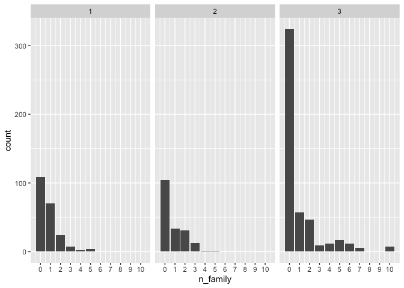

# Lab_5


``` r
knitr::opts_chunk$set(warning = FALSE, message = FALSE)
```

``` r
library(tidyverse)
library(knitr)

# Read in the data
titanic <- read_csv("https://raw.githubusercontent.com/nt246/NTRES-6100-data-science/master/datasets/Titanic.csv")
```

``` r
# look at the top 5 lines of the dataset
titanic |> 
  head(5) |>
  kable()
```

| PassengerId | Survived | Pclass | Name | Sex | Age | SibSp | Parch | Ticket | Fare | Cabin | Embarked |
|---:|---:|---:|:---|:---|---:|---:|---:|:---|---:|:---|:---|
| 1 | 0 | 3 | Braund, Mr. Owen Harris | male | 22 | 1 | 0 | A/5 21171 | 7.2500 | NA | S |
| 2 | 1 | 1 | Cumings, Mrs. John Bradley (Florence Briggs Thayer) | female | 38 | 1 | 0 | PC 17599 | 71.2833 | C85 | C |
| 3 | 1 | 3 | Heikkinen, Miss. Laina | female | 26 | 0 | 0 | STON/O2. 3101282 | 7.9250 | NA | S |
| 4 | 1 | 1 | Futrelle, Mrs. Jacques Heath (Lily May Peel) | female | 35 | 1 | 0 | 113803 | 53.1000 | C123 | S |
| 5 | 0 | 3 | Allen, Mr. William Henry | male | 35 | 0 | 0 | 373450 | 8.0500 | NA | S |

``` r
# to get familiar with the dataset, use these functions
# View(), dim(), colnames()
```

``` r
notes <- read_csv("https://raw.githubusercontent.com/nt246/NTRES-6100-data-science/master/datasets/Notes.csv")
kable(notes)
```

| Variable | Definition | Key |
|:---|:---|:---|
| PassengerId | Passenger ID | NA |
| Survival | Survival | 0 = No, 1 = Yes |
| Pclass | Ticket class | 1 = 1st, 2 = 2nd, 3 = 3rd |
| Name | Pasenger name | NA |
| Sex | Sex | NA |
| Age | Age in years | NA |
| Sibsp | \# of siblings / spouses aboard the Titanic | NA |
| Parch | \# of parents / children aboard the Titanic | NA |
| Ticket | Ticket number | NA |
| Fare | Passenger fare | NA |
| Cabin | Cabin number | NA |
| Embarked | Port of Embarkation | C = Cherbourg, Q = Queenstown, S = Southampton |

#### **Question 1: According to Wikipedia, there was an estimated 2,224 passengers and crew onboard the Titanic when it sank. How many of them do we have information for in this dataset? Of the people we have data for, how many of them survived and how many did not? What is the overall survival rate?**

``` r
# number of passenger in the dataset
nrow(titanic)
```

    [1] 891

``` r
# number of passengers who survived / who died
survived_count <- titanic |> 
  mutate(survived = ifelse(Survived == 0, "no", "yes") ) |> 
  count(survived) |> 
  mutate(percentage = round(n/nrow(titanic)*100,2))

kable(survived_count)
```

| survived |   n | percentage |
|:---------|----:|-----------:|
| no       | 549 |      61.62 |
| yes      | 342 |      38.38 |

``` r
titanic |>
  mutate(survived = ifelse(Survived == 0, "no", "yes")) |>
  ggplot(aes(x = survived)) +
    geom_bar(aes(fill = survived)) +
    geom_label(data = survived_count, aes(label = str_c(percentage, "%"), y = n/2))
```


#### **Question 2. How many passengers on the Titanic were males and how many were females? What do you find when you break it down by ticket class?**

``` r
# female passengers vs female passengers 
sex_count <- titanic |> 
  count(Sex)
kable(sex_count)
```

| Sex    |   n |
|:-------|----:|
| female | 314 |
| male   | 577 |

``` r
sex_count |> 
  ggplot(aes(x = Sex, y = n)) +
    geom_col(aes(fill = Sex)) +
    geom_text(aes(label = n, y = n + 20)) +
    ylab("count")
```


``` r
# female vs male by ticket class
sex_class_count <- titanic |> 
  group_by(Sex, Pclass) |> 
  count()

kable(sex_class_count)
```

| Sex    | Pclass |   n |
|:-------|-------:|----:|
| female |      1 |  94 |
| female |      2 |  76 |
| female |      3 | 144 |
| male   |      1 | 122 |
| male   |      2 | 108 |
| male   |      3 | 347 |

``` r
sex_class_count |> 
  ggplot(aes(x = Sex, y = n)) +
    geom_col(aes(fill = Sex)) +
    geom_text(aes(label = n, y = n + 20)) +
    facet_wrap(~Pclass) +
    ylab("count")
```


#### **Question 3. How many passengers of each sex survived and how many of them did not? What is the survival rate for passengers of each sex?**

``` r
sex_survival_count <- titanic |>
  mutate(survived = ifelse(Survived==0, "no", "yes")) |>
  group_by(Sex, survived) |>
  count() |>
  group_by(Sex) |>
  mutate(percentage = round(n/sum(n)*100, 2))

kable(sex_survival_count)
```

| Sex    | survived |   n | percentage |
|:-------|:---------|----:|-----------:|
| female | no       |  81 |      25.80 |
| female | yes      | 233 |      74.20 |
| male   | no       | 468 |      81.11 |
| male   | yes      | 109 |      18.89 |

``` r
sex_survival_count |>
  arrange(Sex, desc(survived)) |>
  group_by(Sex) |>
  mutate(label_y = cumsum(n) - 0.5 * n) |>
  ggplot(aes(x=Sex)) +
    geom_col(aes(fill = survived, y=n)) +
    geom_label(aes(label = str_c(percentage, "%"), y = label_y))
```


#### **Question 4. For how many passengers do we have age information (including estimated age)? For how many is the age information missing? What is the age distribution for passengers whose age information is available?**

``` r
age_info_count <- titanic |> 
  mutate(age_info = ifelse(is.na(Age), "missing", "available")) |> 
  count(age_info)
kable(age_info_count)
```

| age_info  |   n |
|:----------|----:|
| available | 714 |
| missing   | 177 |

``` r
age_info_count |>
  ggplot(aes(x = age_info, y = n)) +
    geom_col(aes(fill = age_info)) +
    geom_label(aes(y = n + 40, label = n))
```


``` r
titanic |>
  filter(!is.na(Age)) |>
    ggplot(aes(x = Age)) +
    geom_histogram(color = "purple")
```


#### **Question 5. Show the age distribution per ticket class, per sex. What do you find?**

``` r
titanic |> 
  filter(!is.na(Age)) |> 
  ggplot(aes(x = Age, fill = Sex)) +
    geom_histogram(color = "black") +
    facet_wrap(~Pclass)
```


#### **Question 6. How do the sex, ticket class, and age of a passenger affect their chance of survival? Try to use a single plot to answer this question.**

``` r
titanic |> 
  filter(!is.na(Age)) |> 
  mutate(survived = ifelse(Survived == 0, "no", "yes")) |> 
  ggplot(aes(x = Age, fill = survived)) +
    geom_histogram(color = "black") +
    facet_grid(Sex~Pclass)
```


#### **Question 7. Show the distribution of the number of family members (including siblings, spouses, parents, and children) that each passenger was accompanied by. Were most passengers travelling solo or with family?**

``` r
titanic |>
  mutate(n_family = SibSp + Parch) |>
  ggplot(aes(x = n_family)) +
  geom_bar() +
  scale_x_continuous(breaks = 0:10)
```


``` r
titanic |>
  mutate(n_family = SibSp + Parch, with_family = ifelse(n_family > 0, "yes", "no")) |>
  ggplot(aes(x = with_family)) +
  geom_bar()
```


#### **Question 8. Which ticket class did most of the largest families get? And which ticket class has the lowest proportion of female passengers who travelled solo out of all the female passengers in that class?**

``` r
titanic |>
  mutate(n_family = SibSp + Parch) |>
  ggplot(aes(x = n_family)) +
  geom_bar() +
  scale_x_continuous(breaks = 0:10) +
  facet_wrap(~Pclass)
```



``` r
titanic |>
  mutate(n_family = SibSp + Parch, ticket_class = as.character(Pclass)) |>
  ggplot(aes(x = n_family, fill = ticket_class)) +
  geom_bar(color = "black", position = "fill") +
  scale_x_continuous(breaks = 0:10)
```


#### **Question 9. In this dataset, the Fare variable does not represent the fare per person. Instead, each ticket number has a corresponding fare, and some passengers share one single ticket number. Therefore, the Fare variable is the total fare for a group of passengers sharing the same ticket number. Knowing this, calculate the average fare per person. You don’t need to show a table or a figure for this question, just show the code for the calculation.**

``` r
titanic |> 
  group_by(Ticket) |> 
  mutate(n_ticket = n(), fare_per_ticket = Fare/n_ticket) |> 
  ungroup() |> 
  summarize(average_fare = mean(fare_per_ticket))
```

    # A tibble: 1 × 1
      average_fare
             <dbl>
    1         17.8

#### **Question 10. What is the distribution of the per-ticket fare for each ticket class?**

``` r
titanic |>
  group_by(Ticket) |>
  mutate(n_ticket = n(), fare_per_ticket = Fare/n_ticket, ticket_class = as.character(Pclass)) |>
  ggplot(aes(x = fare_per_ticket)) +
  geom_histogram(bins = 100) +
  facet_wrap(~ticket_class)
```


