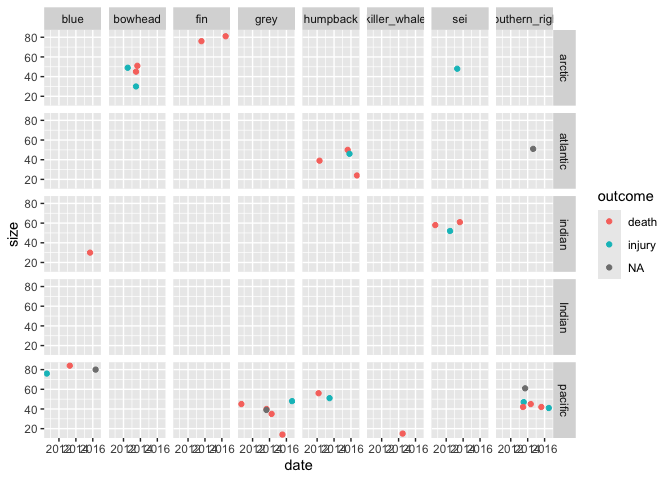
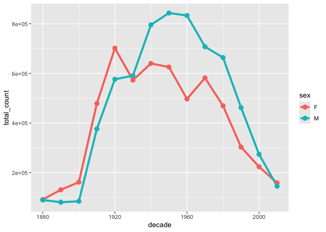
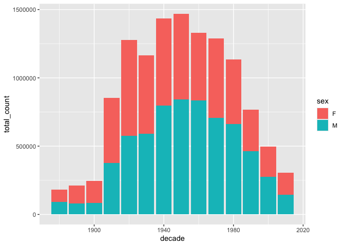

# Lab 6


``` r
knitr::opts_chunk$set(warning = FALSE, message = FALSE)
```

## **Exercise 1: Whale observation**

``` r
library(tidyverse)
library(knitr)
```

``` r
# Read in the data
whales <- read_csv("https://raw.githubusercontent.com/nt246/NTRES-6100-data-science/main/datasets/whales.csv")
whales |> 
  head() |>
  kable()
```

| observer | blue | humpback | southern_right | sei | fin | killer_whale | bowhead | grey |
|---:|:---|:---|:---|:---|:---|:---|:---|:---|
| 1 | 1/20/15, death, , Indian | NA | NA | 8/9/11, injury, , indian | NA | NA | NA | NA |
| 2 | NA | 8/12/15, death, 50, atlantic | NA | NA | 8/2/13, death, 76, arctic | NA | 6/24/13, injury, 30, artic | NA |
| 3 | NA | NA | 7/14/13, injury, 47, pacific | NA | NA | NA | NA | NA |
| 4 | NA | 3/4/12, death, 56, pacific | NA | NA | NA | NA | NA | 5/24/16, death, , pacific |
| 5 | NA | NA | NA | 6/14/12, injury, 52, indian | NA | NA | NA | NA |
| 6 | 5/2/16, , 80, pacific | NA | NA | NA | NA | NA | NA | NA |

#### **Question 1. Create a new data frame that has one row per observer, per species and one single variable of all the information collected. Name this data frame `whales_long`.**

``` r
whales_long <- whales |> 
  pivot_longer(c(blue, humpback, southern_right, sei, fin, killer_whale, bowhead, grey), names_to = "species", values_to = "info")

whales_long |>
  head() |>
  kable()
```

| observer | species        | info                     |
|---------:|:---------------|:-------------------------|
|        1 | blue           | 1/20/15, death, , Indian |
|        1 | humpback       | NA                       |
|        1 | southern_right | NA                       |
|        1 | sei            | 8/9/11, injury, , indian |
|        1 | fin            | NA                       |
|        1 | killer_whale   | NA                       |

#### **Question 2. Starting from `whales_long`, create another data frame that includes only events for which there is information. Name this data frame `whales_clean`.**

``` r
whales_clean <- whales_long |> 
  filter(!is.na(info))

whales_clean |> 
  head() |> 
  kable()
```

| observer | species        | info                         |
|---------:|:---------------|:-----------------------------|
|        1 | blue           | 1/20/15, death, , Indian     |
|        1 | sei            | 8/9/11, injury, , indian     |
|        2 | humpback       | 8/12/15, death, 50, atlantic |
|        2 | fin            | 8/2/13, death, 76, arctic    |
|        2 | bowhead        | 6/24/13, injury, 30, artic   |
|        3 | southern_right | 7/14/13, injury, 47, pacific |

#### **Question 3. Starting from `whales_clean`, create another data frame with one variable per type of information, one piece of information per cell. Some cells might be empty. Name this data frame`whales_split`.**

``` r
whales_split <- whales_clean |> 
  separate(info, into = c("date", "outcome", "size", "ocean_location"), ",")

whales_split |> 
  head() |> 
  kable()
```

| observer | species        | date    | outcome | size | ocean_location |
|---------:|:---------------|:--------|:--------|:-----|:---------------|
|        1 | blue           | 1/20/15 | death   |      | Indian         |
|        1 | sei            | 8/9/11  | injury  |      | indian         |
|        2 | humpback       | 8/12/15 | death   | 50   | atlantic       |
|        2 | fin            | 8/2/13  | death   | 76   | arctic         |
|        2 | bowhead        | 6/24/13 | injury  | 30   | artic          |
|        3 | southern_right | 7/14/13 | injury  | 47   | pacific        |

#### **Question 4. Starting from `whales_split`, create another data frame in which all columns are parsed as instructed below. Name this data frame `whales_parsed`.**

The columns should parsed to the following types  
\* `observer`: double  
\* `species`: character  
\* `date`: date  
\* `outcome`: character  
\* `size`: integer  
\* `ocean`: character

``` r
whales_parsed <- whales_split |>
  type_convert(col_types = cols(date = col_date(format = "%m/%d/%y"), size = col_integer()))
```

#### **Question 5. Using `whales_parsed`, print a summary table with: 1) number ship strikes by species, 2) average whale size by species, omitting NA values in the calculation.**

``` r
whales_parsed |> 
  group_by(species) |> 
  summarize(strike_count = n(), average_size = mean(size, na.rm = T))
```

    # A tibble: 8 × 3
      species        strike_count average_size
      <chr>                 <int>        <dbl>
    1 blue                      5         67.5
    2 bowhead                   5         43.8
    3 fin                       4         78.5
    4 grey                      7         36.8
    5 humpback                  7         44.3
    6 killer_whale              2         15  
    7 sei                       5         54.8
    8 southern_right            7         47  

``` r
whales_parsed |> 
  head() |> 
  kable()
```

| observer | species        | date       | outcome | size | ocean_location |
|---------:|:---------------|:-----------|:--------|-----:|:---------------|
|        1 | blue           | 2015-01-20 | death   |   NA | Indian         |
|        1 | sei            | 2011-08-09 | injury  |   NA | indian         |
|        2 | humpback       | 2015-08-12 | death   |   50 | atlantic       |
|        2 | fin            | 2013-08-02 | death   |   76 | arctic         |
|        2 | bowhead        | 2013-06-24 | injury  |   30 | artic          |
|        3 | southern_right | 2013-07-14 | injury  |   47 | pacific        |

#### **Question 6. Try to summarize as much information contained in `whales_parsed` as possible in one plot.**

``` r
whales_parsed |>
  mutate(ocean = ifelse(ocean_location == "artic", "arctic", ocean_location)) |>
  ggplot(aes(x=date, y = size, color=outcome)) +
    geom_point() +
    facet_grid(~ocean~species)
```



## **Exercise 2: Baby names**

``` r
library(babynames) # install.packages("babynames")

babynames |>
  head() |>
  kable()
```

| year | sex | name      |    n |      prop |
|-----:|:----|:----------|-----:|----------:|
| 1880 | F   | Mary      | 7065 | 0.0723836 |
| 1880 | F   | Anna      | 2604 | 0.0266790 |
| 1880 | F   | Emma      | 2003 | 0.0205215 |
| 1880 | F   | Elizabeth | 1939 | 0.0198658 |
| 1880 | F   | Minnie    | 1746 | 0.0178884 |
| 1880 | F   | Margaret  | 1578 | 0.0161672 |

#### **Question 1: What are the 6 most popular boy names and girl names of all time? How has the popularity of each of these names changed over time?**

``` r
top_6_male_names <- babynames |>
  filter(sex == "M") |>
  group_by(name) |>
  summarize(total_count = sum(n)) |> 
  arrange(-total_count)

top_6_female_names <- babynames |> 
  filter(sex == "F") |> 
  group_by(name) |> 
  summarize(total_count = sum(n)) |> 
  arrange(-total_count)
```

#### **Question 2. What are the most popular boy names and girl names in each decade?**

``` r
babynames |>
  mutate(decade = floor(year/10)*10) |>
  group_by(sex, decade, name) |>
  summarize(total_count = sum(n)) |>
  group_by(sex, decade) |>
  slice_max(order_by = total_count, n = 1) |> 
  ggplot(mapping = aes(x = decade, y = total_count, color = sex)) +
    geom_line(size = 1.5) +
    geom_point(size = 3)
```



#### **Question 3. Continue to explore the `babynames` dataset.**

``` r
babynames |>
  mutate(decade = floor(year/10)*10) |>
  group_by(sex, decade, name) |>
  summarize(total_count = sum(n)) |>
  group_by(sex, decade) |>
  slice_max(order_by = total_count, n = 1) |> 
  ggplot(mapping = aes(x = decade, y = total_count, fill = sex)) +
    geom_col()
```


