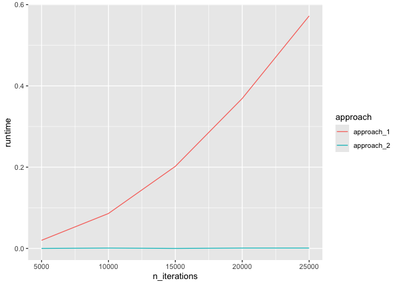

# Lab_8


``` r
knitr::opts_chunk$set(warning = FALSE, message = FALSE)
```

``` r
library(tidyverse)
```

## **Exercise 1: Optimize for loops**

Design an experiment to systematically compare the computational
efficiency between the two approaches. Which approach is more efficient,
and why might that be?

**Hints**:

- the `system.time()` function may be helpful

- try to compare the runtime of the two approaches with different
  numbers iterations

``` r
fruits <- list("apple", "mango", "peach")

for (x in fruits) {
  print(paste("I like", x))
}
```

    [1] "I like apple"
    [1] "I like mango"
    [1] "I like peach"

``` r
  x <- 1:50
  y <- 51:100
  z <- NULL
for (i in 1:length(x)){
  z <- c(z, x[i] + y[i])
}
z
```

     [1]  52  54  56  58  60  62  64  66  68  70  72  74  76  78  80  82  84  86  88
    [20]  90  92  94  96  98 100 102 104 106 108 110 112 114 116 118 120 122 124 126
    [39] 128 130 132 134 136 138 140 142 144 146 148 150

``` r
n_iterations <- (1:5)*5000
approach_1 <- vector("double", length(n_iterations))
approach_2 <- vector("double", length(n_iterations))

for (i in 1:length(n_iterations)){
  n <- n_iterations[i]
  vector_of_1 <- NULL
  approach_1[i] <- system.time(
    for (j in 1:n){
      vector_of_1 <- c(vector_of_1, 1)
    }
  )[3]
  vector_of_1 <- vector(mode = "double", length=n)
  approach_2[i] <- system.time(
    for (j in 1:n){
      vector_of_1[j] <- 1
    }
  )[3]
}

tibble(n_iterations, approach_1, approach_2) |>
  pivot_longer(2:3, names_to = "approach", values_to = "runtime") |>
  ggplot(aes(x=n_iterations, y=runtime, color=approach)) +
  geom_line()
```


``` r
###

n_iterations <- (1:5)*5000
approach_1 <- vector("double", length(n_iterations))
approach_2 <- vector("double", length(n_iterations))

for (i in 1:length(n_iterations)){
  n <- n_iterations[i]
  vector_of_1 <- NULL
  approach_1[i] <- system.time(
    for (j in 1:n){
      vector_of_1 <- c(vector_of_1, 1)
    }
  )[3]
  vector_of_1 <- vector(mode = "double", length=n)
  approach_2[i] <- system.time(
    for (j in 1:n){
      vector_of_1[j] <- 1
    }
  )[3]
}

tibble(n_iterations, approach_1, approach_2) |>
  pivot_longer(2:3, names_to = "approach", values_to = "runtime") |>
  ggplot(aes(x=n_iterations, y=runtime, color=approach)) +
  geom_line()
```



## **Exercise 2: Infinite monkey theorem and Markov Chain Monte Carlo simulation**

#### **2.1 Write a loop that generates a random paragraph using MCMC simulation.**

``` r
for (i in 1:5) {
  print(i)
}
```

    [1] 1
    [1] 2
    [1] 3
    [1] 4
    [1] 5

``` r
set <- c(letters, " ", ",", "!")
x <- 1
n <- 1000
for (x in 1:n){
  if(x == 1){
    current_letter <- sample(LETTERS, 1)
    monkey <- current_letter
  } else {
    if(last_letter == "!" & x != n){
      current_letter <- str_c(" ", sample(LETTERS, 1))
    } else if(last_letter == "," & x != n){
      current_letter <- str_c(" ", sample(letters, 1))
    } else if(last_letter %in% c(",", "!") & x == n){
      current_letter <- " "
    } else if(last_letter == " "){
      current_letter <- sample(letters, 1)
    } else if (str_count(last_letter) == 2){
      current_letter <- ""
    } else {
      current_letter <- sample(set, 1)
    }
    monkey <- str_c(monkey, current_letter)
  }
  last_letter <- current_letter
}
```

#### 

#### **2.2 Building on the last question, come up with one additional rule and apply it to your random paragraph generator.**
